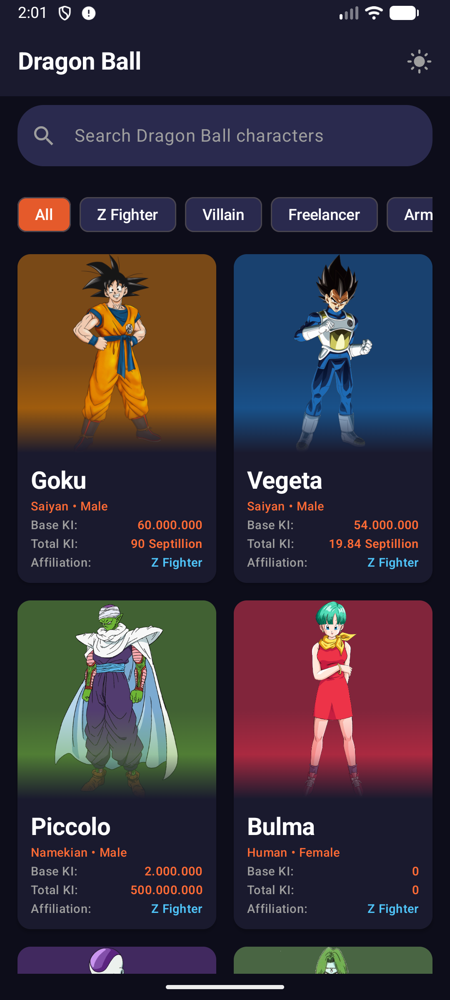
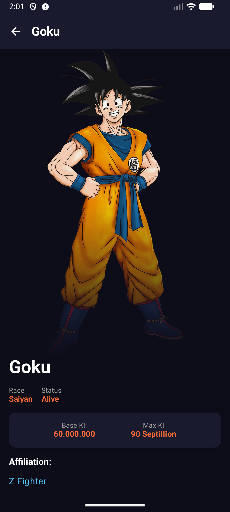
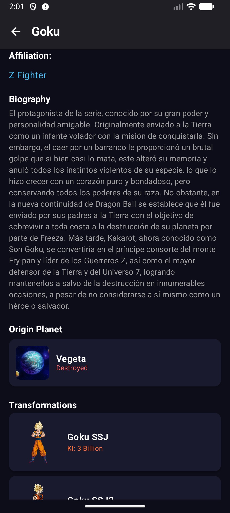
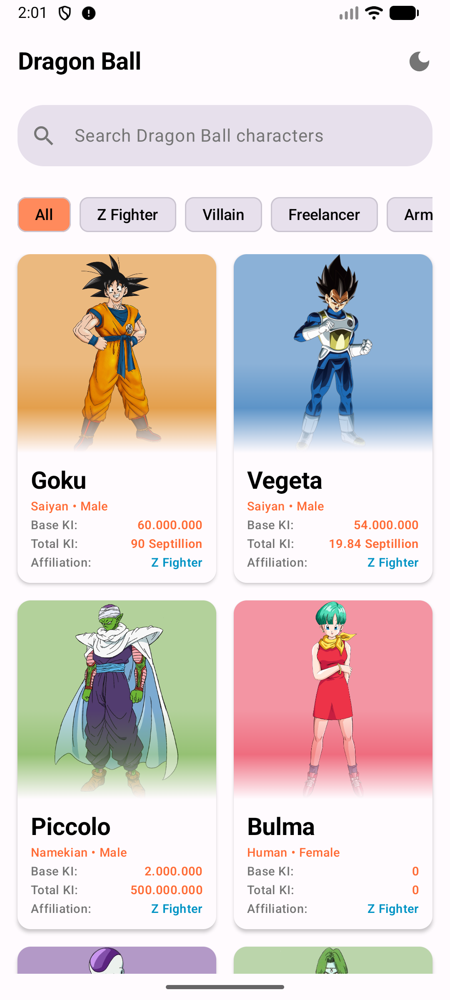
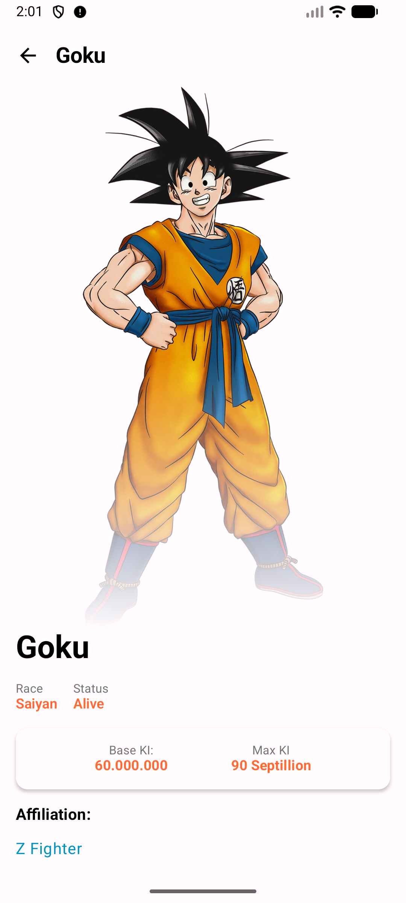
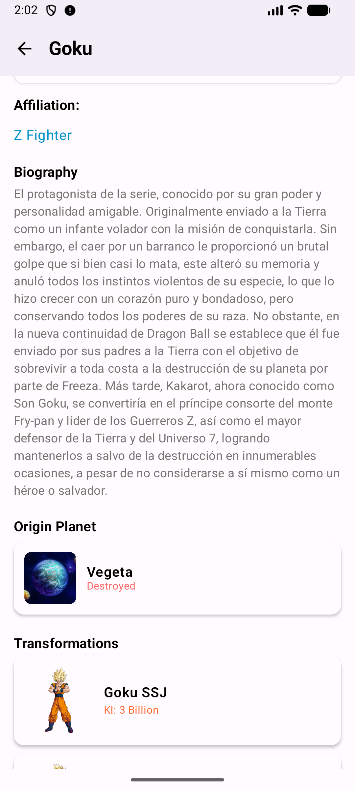

# Dragon Ball Z

An Android app that fetches and displays Dragon Ball characters using the [Dragon Ball API](https://web.dragonball-api.com/documentation). Built with Kotlin, Jetpack Compose, and a modular architecture.

---

## Demo
### Screenshots

| Characters list | Character details |
|-----------------|--------------------|
|  |  |

| Screenshot | Screenshot |
|-----------------|------------|
|  |  |

| Screenshot | Screenshot |
|------------|------------|
|  |  |

---

## Minimum requirements

- **Android SDK**: minSdk 24, targetSdk 36, compileSdk 36
- **Kotlin**: 2.1.0
- **JDK**: 11
- **Android Studio**: Recommended latest stable (or compatible with AGP 8.x)
- **Device/emulator**: For instrumented tests, a connected device or emulator is required

---

## Tech stack

| Category | Technology |
|----------|------------|
| **Language** | Kotlin 2.1.0 |
| **UI** | Jetpack Compose (Compose BOM 2026.02.00), Material 3 |
| **Navigation** | Navigation Compose 2.9.7 (with shared element transitions) |
| **DI** | Hilt 2.56.1 |
| **Networking** | Retrofit 2.11.0, OkHttp, Gson |
| **Local storage** | Room 2.8.4, DataStore Preferences |
| **Paging** | Paging 3.4.1 (with RemoteMediator) |
| **Async** | Kotlin Coroutines, Flow |
| **Image loading** | Coil (Compose) |
| **Color extraction** | AndroidX Palette (for character card background from image) |
| **Logging** | Timber |
| **Stability** | Kotlinx Collections Immutable (domain/UI models) |

Dependencies are managed via a **Gradle Version Catalog** (`gradle/libs.versions.toml`) with shared version refs and bundles.

---

## Architecture

The app follows **MVVM** with a clear separation of layers and **modularization** by feature and core capability.

### Layers

- **UI (app + feature modules)**  
  Compose screens and ViewModels. ViewModels call use cases and expose UI state (e.g. `StateFlow`, `Flow<PagingData>`). No direct access to repositories or data sources.

- **Domain**  
  Use cases, repository interfaces, and domain models. No Android or framework dependencies (only Kotlin, coroutines, paging types, and kotlinx-collections-immutable). Defines *what* the app does, not *how*.

- **Data**  
  Repository implementations, mappers (DTO/Entity ↔ Domain), and paging (RemoteMediator). Coordinates network and local DB and exposes a single API to the domain layer.

- **Local (Room)**  
  Database, DAOs, and entities. Used by the data layer for persistence and as the source of truth for paged lists and character details.

- **Remote (Network)**  
  API service (Retrofit) and DTOs. Used by the data layer to fetch characters and character details.

### Modules

| Module | Role |
|--------|------|
| **app** | Application entry, navigation host, theme (DataStore-backed), Hilt app component |
| **feature:characters** | Characters list screen: paged list, search, affiliation filter, theme toggle |
| **feature:character-details** | Character detail screen: bio, planet, transformations, shared element transition |
| **core:domain** | Use cases, `CharacterRepository` interface, domain models (e.g. `CharacterSummary`, `CharacterDetails`) |
| **core:data** | `CharacterRepositoryImpl`, mappers, `CharactersRemoteMediator` |
| **core:database** | Room database, DAOs, entities, `CharacterWithDetails` |
| **core:network** | Retrofit API, DTOs |
| **core:datastore** | Theme preference (DataStore) |
| **core:common** | DispatcherProvider, extensions, error types |
| **core:navigation** | Navigation routes and destinations |
| **core:designsystem** | Theme (colors, typography, shapes), reusable UI building blocks |

Data flow is one-way: **UI → ViewModel → Use case → Repository → (Network / Room)**. Results flow back as Flow/StateFlow or suspend returns.

---

## Design patterns

- **MVVM** – ViewModels hold UI state and business flow; Composables observe state and send events.
- **Repository** – Single API for character list and details; hides paging, cache, and network.
- **Use cases** – Thin wrappers (e.g. `GetCharactersUseCase`, `GetCharacterDetailsUseCase`) around the repository to keep ViewModels focused.
- **Dependency injection** – Hilt for all dependencies; interfaces in domain, implementations in data.
- **Cache-first (for details)** – Character details are read from Room first; network is used only when details are missing or on failure fallback.
- **RemoteMediator** – Paging 3 RemoteMediator for “network + local” paging: loads pages from API, writes to Room; UI reads from a Room-backed `PagingSource`.
- **CompositionLocal** – e.g. `LocalDispatcherProvider` for coroutine dispatchers in Compose.
- **Immutable collections** – Domain and UI use kotlinx-collections-immutable where appropriate (e.g. `CharacterDetails.transformations` as `ImmutableList`).
- **UI models at Compose boundary** – Where Compose stability matters, UI-specific models (e.g. `TransformationUi` with `@Immutable`) are used at the call site instead of domain types.

### Character cards and Palette API

Character cards (and the detail hero image) use the **AndroidX Palette API** to set the card background from the character image. After loading the image with Coil, a `Palette` is generated from the bitmap on a background dispatcher. The chosen color is the first available of: vibrant swatch, dominant swatch, light vibrant swatch, or dark vibrant swatch. That color is applied with transparency (e.g. alpha 0.4–0.5) so the image remains visible while the card gets a tinted background. If extraction fails or no swatch is found, a default fallback color is used.

### Theming

Theme preference is stored in **DataStore** (core:datastore) and applied app-wide.

- **Default**: If the user has never changed the theme, the app uses **System** (device light/dark setting).
- **Toggle**: The theme icon on the characters screen cycles the preference: **Light → Dark → System → Light → …**. Each tap persists the new preference to DataStore.
- **On launch**: The saved preference is read at startup and applied (Light, Dark, or System). System follows the device setting; Light/Dark override it.

### Affiliation filter

The characters list can be filtered by **affiliation** (e.g. Z Fighter, Villain, God). The behaviour is as follows.

- **Options**: The list of affiliations is defined in **core:common** (`Affiliations.ALL`): Z Fighter, Villain, Freelancer, Army of Frieza, God, Namekian Warrior, Assistant of Beerus, Assistant of Vermoud, Red Ribbon Army, Pride Troopers, Other.

- **UI**: On the characters screen, **AffiliationFilterChips** show an “All” chip plus one chip per affiliation. Tapping a chip sets the current filter; “All” clears it (`null`). The chips are hidden while the search bar has focus (search and filter are independent: search filters by name, chips filter by affiliation). Selection is stored in `CharactersUiState.selectedAffiliation` and passed to the ViewModel via `onAffiliationChange`.

- **Flow**: The ViewModel feeds `selectedAffiliation` (and `searchQuery`) into the paged flow: after debounce and distinctUntilChanged, it calls `GetCharactersUseCase(Params(affiliation = state.selectedAffiliation, searchQuery = state.searchQuery))`. The repository builds a `Pager` whose **pagingSourceFactory** uses `CharacterDao.pagingSource(affiliation = normalizedAffiliation, searchQuery = normalizedQuery)`.

- **Where filtering happens**: Filtering by affiliation is **entirely local**. The **RemoteMediator** does not take an affiliation parameter. It always fetches full pages from the API and writes every character into the **characters** table. The **CharacterDao** `pagingSource` query applies the filter in SQL: `WHERE (:affiliation IS NULL OR affiliation = :affiliation) AND (... searchQuery ...)`. So when the user changes the affiliation chip, the list is re-read from the existing Room cache with a different `affiliation` (or `null` for “All”); no new network request is made. This keeps the list responsive and works offline for already-cached data.

- **Empty state**: When the filtered list has zero items and the initial load is finished, **EmptyStateContent** is shown (e.g. “No characters for [affiliation]” or a message when only search is active).

---

## Room: tables, relationships, paging, and data flow

### Database

- **Name**: `db_dragon_ball`
- **Version**: 3
- **Migration**: Fallback to destructive migration (no export schema).

### Tables and relationships

1. **`characters`** (`CharacterEntity`)
    - Primary key: `id`
    - Holds list/summary data: name, race, gender, affiliation, image, ki, maxKi.
    - No direct description, planet, or transformations; those come from detail entities or the details API.

2. **`characters_remote_keys`** (`CharacterRemoteKeysEntity`)
    - Primary key: `characterId`
    - Stores paging keys: `prevKey`, `nextKey` (page indices).
    - Used by `CharactersRemoteMediator` to know the next page to load.
    - No foreign key to `characters`; cleared and refilled on REFRESH.

3. **`character_details`** (`CharacterDetailsEntity`)
    - Primary key: `characterId`
    - Foreign key to `characters(id)` with `ON DELETE CASCADE`.
    - Holds description and `deletedAt` (for “Alive” vs “Deceased”).

4. **`character_planets`** (`PlanetEntity`)
    - Primary key: `characterId` (one planet per character).
    - Foreign key to `characters(id)` with `ON DELETE CASCADE`.
    - Fields: planetId, name, isDestroyed, description, image.

5. **`character_transformations`** (`TransformationEntity`)
    - Primary key: `id` (transformation id).
    - `characterId` references `characters(id)` with `ON DELETE CASCADE`.
    - One-to-many: one character, many transformations.
    - Fields: name, image, ki.

**Relationship summary**: `characters` is the central table. Detail tables reference it by `characterId`. Deleting a character removes its details, planet, and transformations via cascade. The app also uses a **Room relation type** `CharacterWithDetails`: it embeds `CharacterEntity` and uses `@Relation` to load `CharacterDetailsEntity?`, `PlanetEntity?`, and `List<TransformationEntity>` in one query for the detail screen.

### Paging (list screen)

- **PagingSource**: `CharacterDao.pagingSource(affiliation, searchQuery)`
    - Returns `PagingSource<Int, CharacterEntity>`.
    - Filters by optional `affiliation` and optional `searchQuery` (name LIKE).
    - Keys are page numbers (Int).

- **RemoteMediator**: `CharactersRemoteMediator`
    - **Initialize**: If the DB already has any characters, returns `SKIP_INITIAL_REFRESH` so filters work on cached data without an immediate network refresh.
    - **REFRESH**: Clears `characters_remote_keys` and `characters`, then loads page 1. If a search query is set, calls the API with `name = searchQuery` and a fixed limit (e.g. 100); otherwise uses config page size.
    - **APPEND**: Next page index comes from `characterRemoteKeysDao().getNextPage()` (max stored `nextKey`), so pagination continues even when the current filter shows no items. Search is treated as single-page (no APPEND).
    - **PREPEND**: Not used; returns `Success(endOfPaginationReached = true)`.
    - Writes each page into `characters_remote_keys` and `characters` inside a single database transaction.

- **Data flow**:
    - Repository creates a `Pager` with this RemoteMediator and the DAO’s `pagingSource`.
    - Flow is mapped from `CharacterEntity` to domain `CharacterSummary`.
    - UI collects the Flow and uses `LazyPagingItems` (or equivalent) to display the list.  
      So: **list data is fetched from the API by the RemoteMediator, stored in Room, then read by the PagingSource**. Filtering (affiliation, search) is done in the DB query; the mediator does not filter what it stores (it stores full pages for the current request).

### Character details: fetch and store

- **Cache-first**:
    - Repository first calls `characterDao().getCharacterWithDetails(characterId)`.
    - If the result has `extras != null` (i.e. detail row exists), it maps `CharacterWithDetails` to `CharacterDetails` and returns immediately (no network).

- **Network and persist**:
    - If details are not cached, repository calls `api.getCharacterById(characterId)`.
    - On success, inside a single Room transaction it:
        - Upserts `CharacterDetailsEntity`
        - Upserts `PlanetEntity` if present
        - Deletes existing `TransformationEntity` rows for that character, then upserts the new list
    - Then returns the mapped `CharacterDetails`.

- **Error fallback**:
    - On network or API error, repository returns cached `CharacterWithDetails` mapped to `CharacterDetails` if available; otherwise it throws.

So: **details are stored in `character_details`, `character_planets`, and `character_transformations` after a successful API fetch, and later reads are served from Room.**

---

## Tests

### Scope

- **Unit tests (JVM)**
    - **core:datastore**: `ThemePreferenceTest`, `ThemeDataStoreTest` (theme enum and DataStore read/write).
    - **core:data**: `CharacterMappersTest` (DTO/Entity ↔ Domain mappers), `CharacterRepositoryImplTest` (cache-first details, network persist, error fallback, `withTransaction` mocked).
    - **feature:characters**: `CharactersViewModelTest` (UI state, query/affiliation, use case invocation).
    - **app**: `ThemeViewModelTest` (theme StateFlow and toggle).

- **Instrumented tests (Android)**
    - **core:database**: `CharacterDaoTest` (pagingSource, filters, `getCharacterWithDetails`, hasCharacters, clearAll, cascade), `CharacterRemoteKeysDaoTest` (upsert, getNextPage, clearAll).
    - **app**: `HiltDependencyTest` (Hilt graph injects repository, use cases, ThemeDataStore); uses `CustomTestRunner` and Hilt test application.

Libraries used: **JUnit 4**, **MockK**, **Turbine** (Flow), **Truth** (assertions), **Kotlinx Coroutines Test**, **Room testing** (in-memory DB). Test dependencies are grouped in the version catalog (e.g. `test-unit`, `test-android` bundles).

## API

The app uses the Dragon Ball API:

- **Base URL**: `https://dragonball-api.com/api/`
- **List/search**: `GET characters?page=&limit=&name=` (optional `name` for search).
- **Details**: `GET characters/{id}`

List and search are paginated; details are fetched per character when the user opens the detail screen and are then cached in Room.

---
